# E-Commerce Website

## Project Description

This is a full-featured e-commerce website built with **PHP and MySQL**, including an admin panel for managing products, categories, brands, orders, payments, and users.

The project demonstrates real-world CRUD operations, database relationships, and basic e-commerce logic.

---

## Development Tools


---

## Technologies


---

## Database Structure

The system includes the following tables:

- `products` — product information
- `categories` — product categories (genres)
- `brands` — literature / publishers
- `user_table` — registered users
- `user_orders` — orders
- `user_payments` — payment records
- `orders_pending` — temporary order tracking

---

## Main Features

### Store Front
- Display all products
- Filter by categories and brands
- Product images (multiple images per product)
- Product pricing and details

---

### Orders System
- Add products to orders
- Track order status
- View order details
- Count total products per order

---

### Payments
- Store payment information
- View payment history
- Payment method tracking
- Payment date tracking

---

### Users
- User registration system
- User profile data
- Contact information (email, phone, address)

---

## Admin Panel Features

The admin can:

- Add new products
- Edit products
- Delete products
- Manage categories (genres)
- Manage brands (literature)
- View registered users
- Manage orders
- View payments

---

## Key Functionalities

- Full CRUD system (Create, Read, Update, Delete)
- Image upload handling for products
- SQL relational database structure
- Dynamic product counting in orders
- Bootstrap-based responsive admin dashboard
- Modal confirmation for delete actions

---

## Authentication

Admin system includes:

- Admin registration
- Admin login
- Secure access to dashboard

---

## Screenshots

### diagram bd
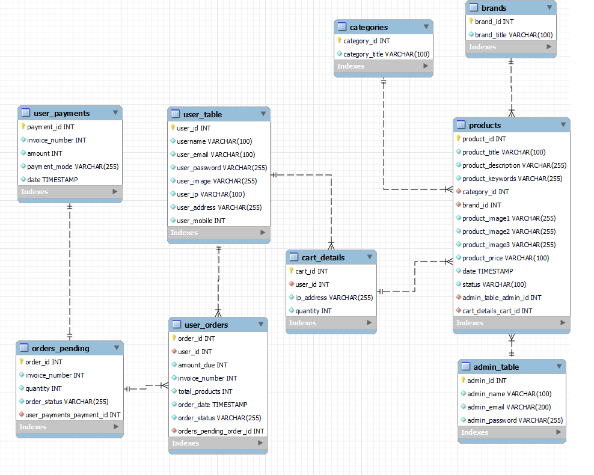

### Home page


### Contact information


### Shopping cart
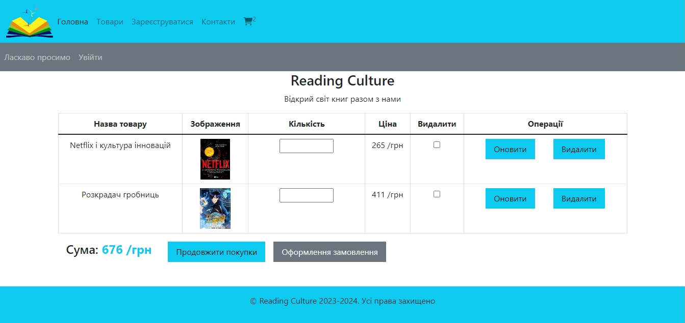

### User profile
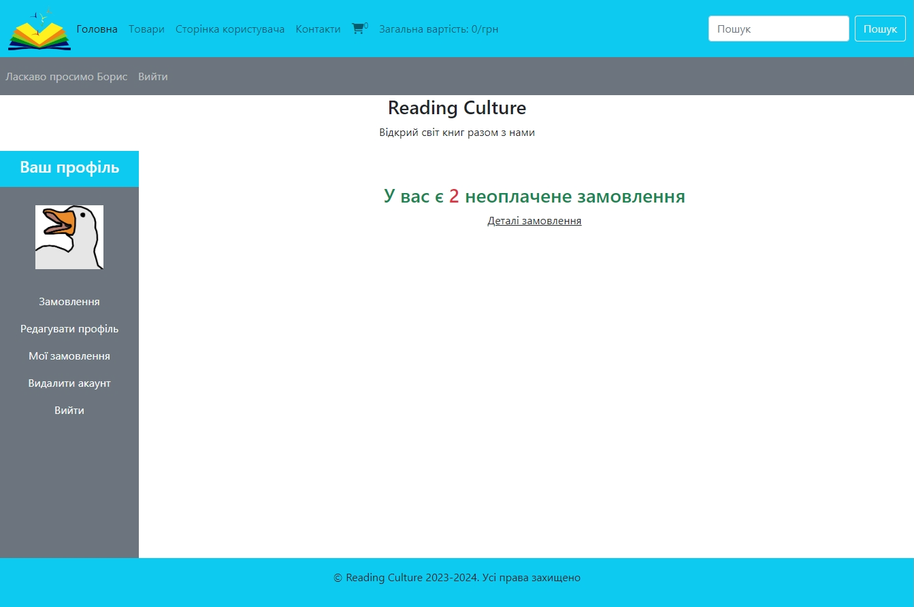

### User order
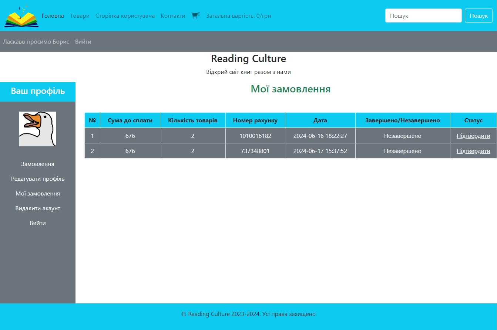

### Adding products
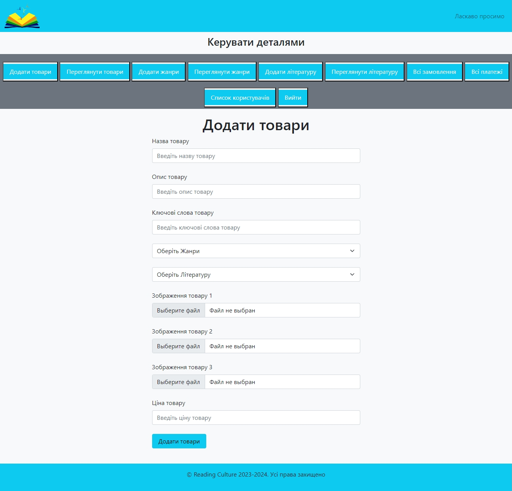

### All products
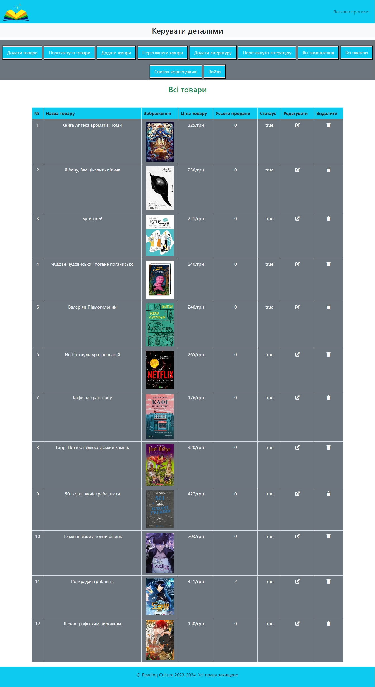

### Add genre
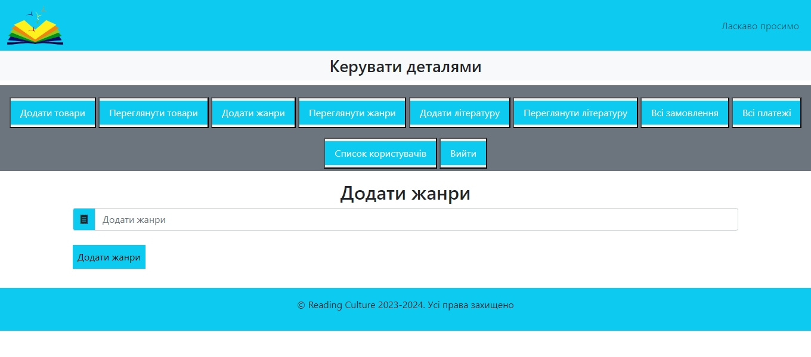

### All genres
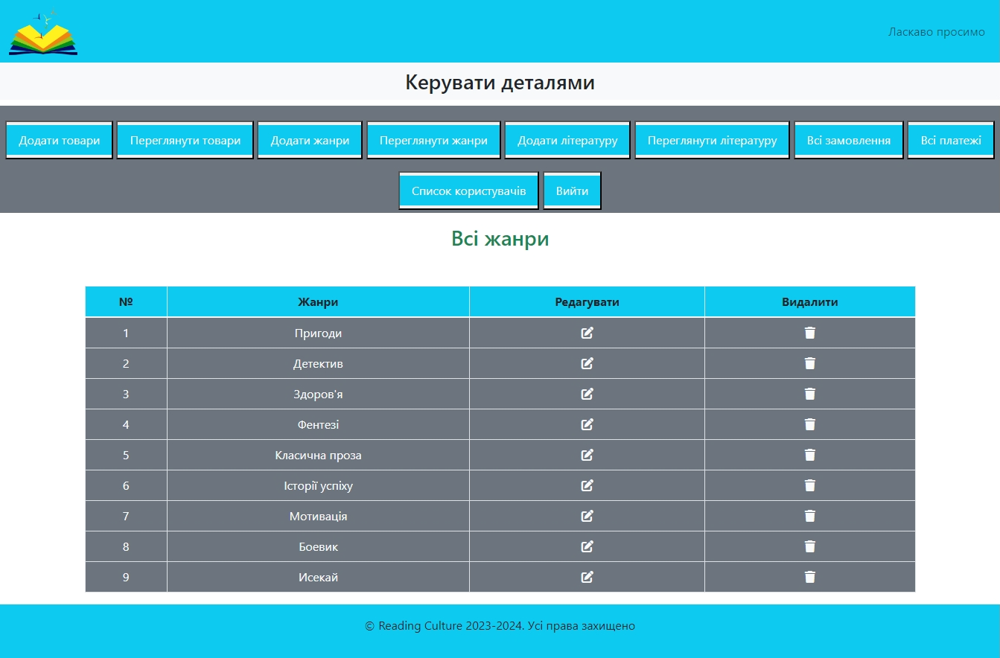

### Edit product
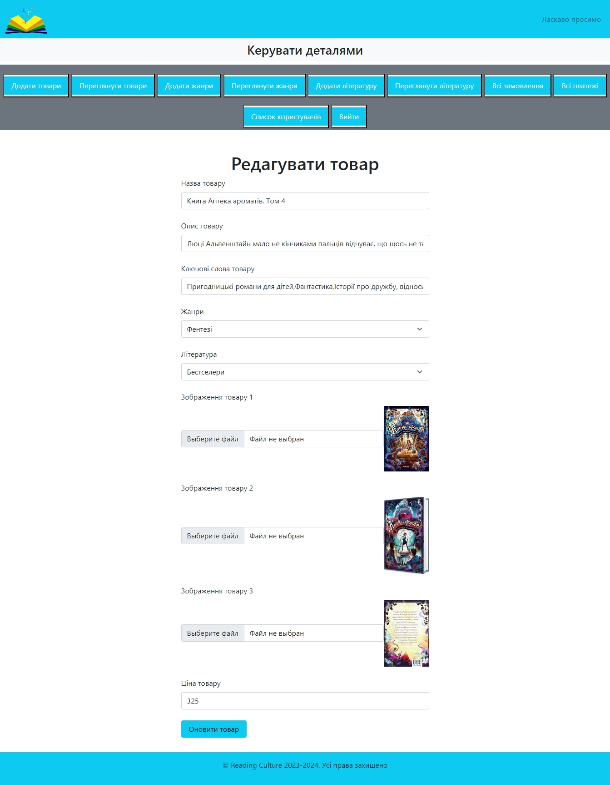

### Add literature
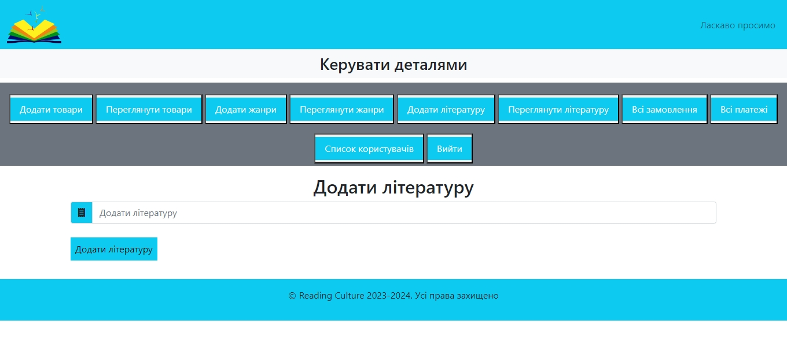

### All order
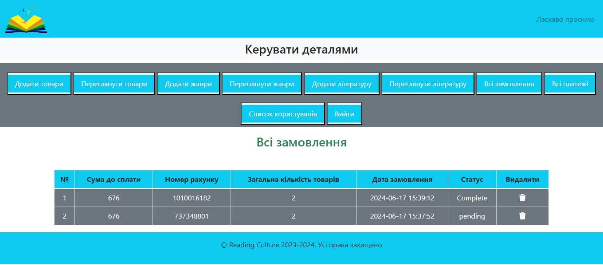

### All payments
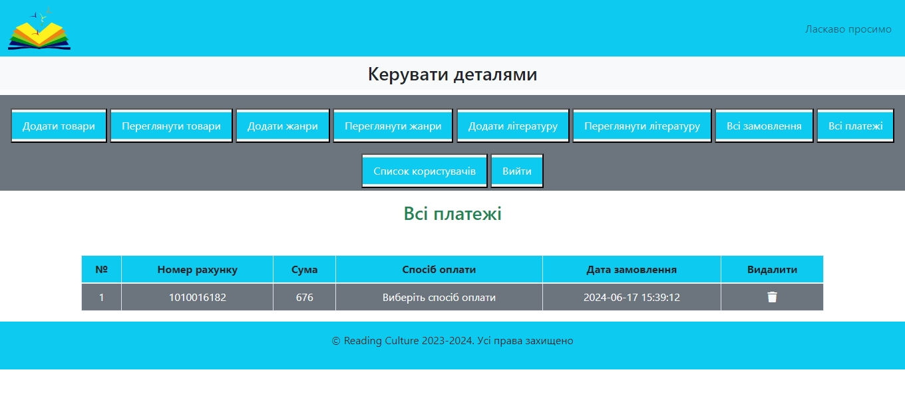

### Created users
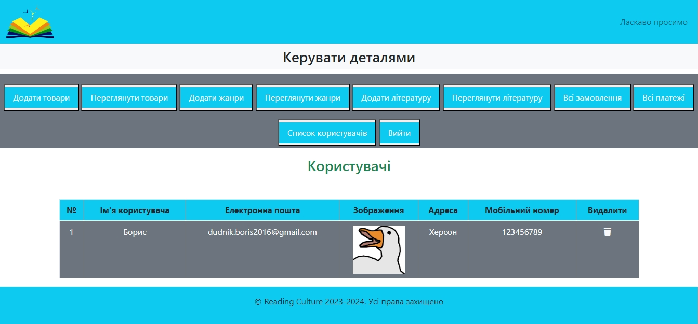

---

## How to Run the Project

1. Clone the repository:
```bash
git clone https://github.com/BorysDudnyk/Ecomers-website
```
